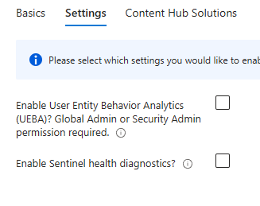
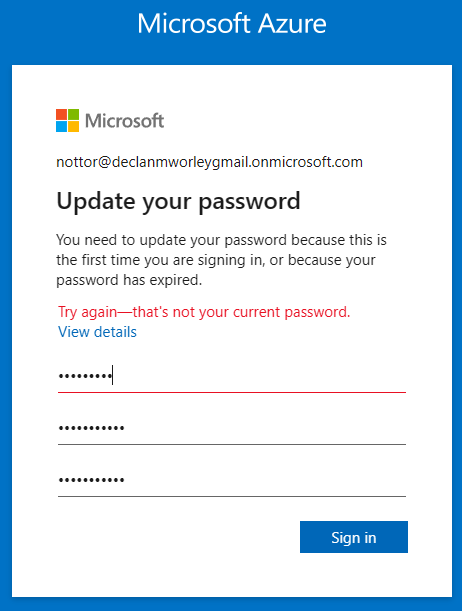
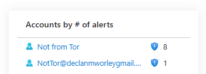
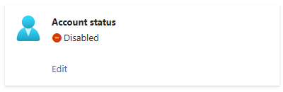

# Microsoft Sentinel SIEM Lab | Declan Worley

## Objectives:

- Deploy Microsoft Sentinel SIEM in Azure Cloud.
- Implement advanced configurations to enhance threat detection capabilities.
- Create custom analytics rules using KQL to detect specific security events and patterns.
- Conduct incident investigations using SIEM tools and techniques to analyze cybersecurity incidents.
- Showcase attacker perspective on Azure Portal.
- Implement remediation actions to mitigate and resolve identified cybersecurity incidents.

### Tools Utilized: Microsoft Sentinel, Azure Cloud

## Task 1) Setting up Microsoft Sentinel

I started with the Microsoft Sentinel All-in-One tool, which greatly will simplify the deployment of a Microsoft Sentinel environment. The tool is available in this [Azure-Sentinel GitHub repository](https://github.com/Azure/Azure-Sentinel/tree/master/Tools/Sentinel-All-In-One).

    

To start, I used the "Deploy to Azure" button. Doing so deploys Microsoft Sentinel using a pre-defined template, which makes our setup simple. In a production environment, the location of your Azure deployment can be crucial, as there are industry standards that can dictate where you need to store user data. 

    
    

    

Next, I will head over to the Content Hub solutions and enable everything across the three categories. This includes data connectors and Azure Active Directory log types.  

    
    

    

As a time saver, I'll also enable the scheduled alert rules for the selected Content Hub solutions and Data Connectors. That way, I don't have to manually set each one up.  

    

After about 10 to 15 minutes, the deployment was completed. Initially it had shown a failure message due to the lack of licenses for some of the Content Hub solutions (since I had selected them all), but the rest of the deployment should function normally.  

    

## Task 2) Exploring and Configuring Microsoft Sentinel

With the deployment complete, I moved on to configuring Microsoft Sentinel. The first step was creating a diagnostics setting to send logs to our Log Analytics Workspace.  

    

When we access the Microsoft Sentinel workspace, it reveals a dashboard the displays a bit of information on incidents, automation, data received, and analytics rules. I'll shift my focus now over to the logs section, where I can search through all of our log data using Kusto Query Language (KQL) queries. There is also a query hub with many frequently used queries that can help for easy data analysis.

    
    

One custom log of interest here is the Azure_Activity_CL, which provides us with detailed information about actions that were taken on the SIEM portal, such as who performed an action, when it happened, and other relevant properties. These logs are invaluable during investigation, and we can use other logs to provide additional contect, such as the location data from Active Directory access.  

    
    

The Content Hub in the workspace offered various solutions and tools to bolster protection against different types of activity. The Data Connectors options provided insight into each solution by detailing the type, number of logs, and table names involved.  

    

In the Analytics section, we can review our active detections rules, which are crucial for threat monitoring. Some of the notable examples provided by Microsoft are Solorigate Network Beacon, D365 - Audit log data deletion, and Process executed from binary hidden in Base64 encoded file.  

    

Additionally, the Anomalies section presents various anomaly-based detection templates, many of which utilize User and Entity Behavior Analytics (UEBA). While its not yet enabled on our instance, it can offer us powerful AI-driven detection capabilities. You can modify the thresholds to your needs as well, in case you run into too many false positives.  

    

## Task 3) Implementing and Testing UEBA

User and Entity Behavior Analytics (UEBA) is an AI-powered feature in Microsoft Sentinel designed to detect any abnormal behavior that occurs on your system. I enabled UEBA and also set up automation of playbooks for our SIEM environment. This involved configuring the permissions for the resource group that our Microsoft Sentinel deployment was under.

    
    

 

    
    

Watchlists are another important feature that I was able to explore. The process of creating a new watchlist is relatively simple, and once it is created you can easily view and query the logs associated with it. We will make a watchlist that will check for any IP's that are Tor IP nodes.

    
    

 

    
    

## Creating an Analytics Rule

With the watchlist now set up, I will move on to create a custom Analytics rule to detect threats that are sourced from the Tor IPs. To do this, navigate over to the Analytics settings and create a "Scheduled Query Rule". I named this one "Successful Sign-ins From Tor Network" and gave it a description-I just generated a related one from ChatGPT as an example.

This is the rule logic that I used:  
let TorNodes = (\_GetWatchlist('TOR-IPs') | project TorIP = IpAddress);  
SigninLogs  
| where IPAddress in (TorNodes)  
| where ResultType == "0"  
| project TimeGenerated, UserPrincipalName, IPAddress, Location, AppDisplayName, ClientAppUsed, DeviceDetail  

    

Since we don't have any sign-in data from Tor IPs at this time, no alerts should pop up. However, we can go on and add Entity mapping, Custom details, and Alert details to further customize our rule. Entity mapping classified our rule under Account and IP, while Custom details help us to surface key parameters for easier analysis through key-value pairs. I also customized the alert so that it will notify us of "Successful Sign-ins from Tor Network IP &lt;IP_address&gt;" whenever it is triggered.  

    
    

I also explored the alert grouping feature, which allows for us to group alerts based on shared details, such as same user or location. One thing to keep in mind is that the grouping is limited to a maximum of 150 alerts per group, with any overflow incidents being placed in a new group.  

    

## Attacker Gains User Access

To simulate an attack scenario, I created a new user account on the Azure portal to perform unusual activity and test our alerts. Firstly, I went an disabled the security defaults on Microsoft Entra ID (New Azure AD) which are enabled by default to provide users with baseline protection. It includes various security features such as MFA for administrators, blocking legacy authentications, and strong password requirements.  

    
    

For this example, I created a nbew user with the principal name "NotTOr" and the display name "Not from Tor". The system automatically generated a password, and I filled in the additional properties such as account type, company information, and their contact details.  

    

After the account creation, I assigned it with the "Security Reader" role. I also added a role assignment for the user under the resource group 'SIEM' in the Access control settings, giving it the "Contributor" privileges under the "Priviliged administrator roles".  

    
    

In a new browser, I went ahead and logged into the new account. On first login, it prompts us to create a new password, enforcing its security requirements and not allowing "password123"-though it let me use a password like "7ujMko0admin", which was found to be actively scanned during our Azure Honeypot Lab.  

    
    

Once I was logged in, I was able to access the SIEM resource group through the Azure portal. Further, to mimic an attacker, I used the "New private window with Tor" feature on Brave browser to log in as our new user. Once I had gained access, I made sure to take a few steps that an attacker might take, such as gaining persistence through changing the password and disabling dianostic settings on our SIEM.  

    
    

    
    

    
    

    

In Microsoft Sentinel, I had noticed that it required me to log in again due to a recent password change, which seems to offer limited protection as the attacker already had, and changed, the credentials. I then navigated over to the settings and deleted the diagnostic settings under the "Auditing and health monitor" section.  

    

An attacker that has access to an account like this would also likely use the Azure Portal shell interface to try and run scripts to escalate their privileges. Tools like Microburst and Azure Hound are commonly used here to search for passwords and credentials. It did prompt use to create a new storage account, since it wasn't used previously, but that was a relatively easy task. Attackers might also try to set up crypto miners on Azure, which can lead to significant resource use and unauthorized costs.  

    

To showcase this, I created a new VM as our attacker. Choosing a subtle name like "WebSrv-Cache", so that it would potentially blend in with other VMs on a production environment, I was able to deploy a VM that could be easily used for crypto mining. This scenario can highlight the potential risks and costs that are associated with an attacker gaining access into our Azure environment.  

    

## Viewing the detected threats in Microsoft Sentinel

I switched back to the owner account, and I immediately noticed some newly created incidents on the Microsoft Sentinel dashboard. These had likely triggered as a result of the actions performed while using the attacker account. By navigating to the Incidents under Threat Management, I was able to easily investigate into the details of the detections.  

    

It was very interesting to see how effectively that Microsoft Sentinel was able to track the attacker's account activities. Also, several incidents had been linked to the analytics rule that was setup for detecting successful sign-ins fromn the Tor network, as well as other suspicious activities. It's important to note that if multiple incidents share common entities, such as Account or IP, then Sentinel is able to correlate those activities and identify patterns that point to the attacker.

There is also a feature here giving you the ability to assign incidents to yourself, or other team members, which can help ensure accountability and make responsibilities clear for the incident resolution process.  

    
	

By clicking on an incident, we can perform a deeper dive into the details of that event. On the left, it offers incident details and a breakdown of what was detected, along with the entities involved and evidence collected. By clicking on the evidence, it created a KQL query associated with the detection, which can offer us more insight into the data that the rule captured.

One other aspect of this was that we can check the IP addresses that were involved in the incident. I used AbuseIPDB, and was able to verify that the IP in question had indeed been sourced from the Tor network and even had multiple recent abuse reports already tied to it, and recently too. 

    
	

 

    

Heading back to the logs, I was able to confirm that the ResultType was a '0', which indicates a successful login. Additionally, the sign-in attempts can be seen originating from various different countries, which already raises many red flags.  

    
	

 

    

By clicking on the account, I could see a whole timeline of activities, including the specific alerts the account was involved in. We can also click on the type of activity performed by that user and it will automatically generate a in-depth log query, going through many different tables, to give you a full view of the actions taken. It includes actions such as when the attacker deleted diagnostic settings, setting up a VM, and even states whether the action was successful or not.  

    
	

 

    
	

 

    

## Remediation

With all of the evidence collected, we can start on remediating this attack. This kind of activity could stem from a disgruntled fromer employee or just an external part who manged to compromise an employee's password. Either way, our priority now is to cut off the attacker's access to the Azure Shell and secure the environment, which we can do through deleting or disabling the account. In production, it would also be a good idea at this point to check over their permissions and make sure they correlate to their function in the company.

I'll navigate to Microsoft Entra ID to find our compromised user account. To disable the account, it's relative straightforward, and we can just click on Account Status and uncheck the enabled checkbox.  

    
	

 

    

Next, I wanted to focus on the crypto miner VM that the attacker was able to provision. Since this could lead to a significant bill if left unchecked, I wanted to delete it to prevent any further resource usage and cost. To find the VM, I was able to check through the account's activity logs to correctly identify the instance name.  

    
	

Lastly, we will want to reenable our diagnostic and health settings in Microsft Sentinel. To do so, I will search for "Log Analytic Workspaces" and then go into Diagnostic settings, and make sure that all logs are sent to our workspace. I will also go into Microsoft Sentinel and navigate to the settings to enable our auditing and health monitoring settings.  

    
	

 

    

Throughout this process, I documented the evidence and remediation steps directly within the incident. This not only keeps team members informed but also serves as a valuable reference for handling similar incidents in the future. Once the investigation and remediation were complete, I closed the incidents and classified them as true positives, which helps in maintaining accurate records of incidents and responses.

Throughout this process, it is important to make comments to document the evidence and remediation steps directing within the incident. This keeps team members informed and serves as a valuable future reference when handling similar incidents. Once the investigation and remediation were complete, I went ahead and closed the incidents and classified them as true positives, which can help you to keep accurate records of your incidents and responses.  

    

# Conclusion

In this lab I was able to demonstrate, deploy, and configure a Microsoft Sentinel SIEM in an Azure Cloud environment, providing a hands-on approach to advanced threat detection and incident management. With the tasks, we were able to explore many of Microsoft Sentinel's capabilities, from setting up a secure and robust SIEM system to creating our own custom analytics rules with Kusto Query Language (KQL) for custom threat detection.

By simulating an attackers point of view as they gained unauthorized access to the system, we were able to test the security measures in place. We showcased how Microsoft Sentinel can detect and alert on suspicious activities automatically, as well as enable security teams to quickly and efficiently response to potential threats. The automation of playbooks and the User and Entity Behavior Analytics (UEBA) highlighted how important proactive monitoring and response is in a modern cybersecurity strategy.

Overall, this lab has provided me with valuable insight into the functionality and real-world applications of Microsoft Sentinel as a SIEM tool. The experience I have gained will be instrumental for understanding how to protect and monitor enterprise environments against everchanging cybersecurity threats, which enhances my readiness for future challenges in the field.